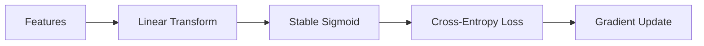

## Machine Learning Approaches for Regression, Classification, and Clustering of Polygons

This repository contains machine learning algorithms and mathematical solvers implemented from first principles using **NumPy** and **PyTorch**.  
Completed as part of university coursework.

Key areas covered:  
- **Linear Algebra:** Solving underdetermined and overdetermined systems  
- **Probability:** Bayesian inference for defect analysis  
- **Regression:** Ridge regression (closed-form) and gradient descent (full/mini-batch)  
- **Classification:** Logistic regression with stable sigmoid and cross-entropy  
- **Unsupervised Learning:** K-Means clustering for polygon shape recognition  
- **Deep Learning:** CNNs for image classification  

---

### Features

#### 1. Linear Algebra Solvers
- Underdetermined systems ($m < n$): Minimum-norm solution using right pseudo-inverse  
- Overdetermined systems ($m > n$): Least-squares solution using left pseudo-inverse (Normal Equations)  

#### 2. Bayesian Inference
- Bayes’ Theorem applied to determine the likelihood of a machine source given defective product observation  

#### 3. Regression Suite
- **Ridge Regression:** Closed-form $L_2$ regularized solution  
- **Gradient Descent:** Full-batch and mini-batch stochastic gradient descent with $L_2$ regularization  

#### 4. Logistic Regression
- Numerically stable sigmoid function to prevent overflow/underflow  
- Cross-entropy (softplus) loss  
- Gradient checking against numerical approximations

#### 5. Shape Clustering & Classification
- **Feature Extraction:** Geometric properties from polygon images  
- **K-Means:** From-scratch clustering of triangles, squares, pentagons, hexagons  
- **CNN (PyTorch):** Classifies noisy, rotated polygon datasets  

---

### Implementation Constraints
- **No external ML libraries** (scikit-learn, TensorFlow, Keras)  
- Heavy use of **NumPy vectorization**  
- Manual implementation for **numerical stability** (Log-Sum-Exp, stable sigmoid)  
- **Deterministic results** via custom RNG wrapper  

---

### Technical Stack
| Tool | Purpose | Documentation |
| :--- | :--- | :--- |
| **Python 3.x** | Core Language | [Python Docs](https://docs.python.org/3/) |
| **NumPy** | Linear Algebra | [NumPy Docs](https://numpy.org/doc/) |
| **PyTorch** | Deep Learning | [PyTorch Docs](https://pytorch.org/) |
| **Matplotlib** | Visualization | [Matplotlib Docs](https://matplotlib.org/) |
| **Pillow** | Image Processing | [Pillow Docs](https://pillow.readthedocs.io/) |

---
